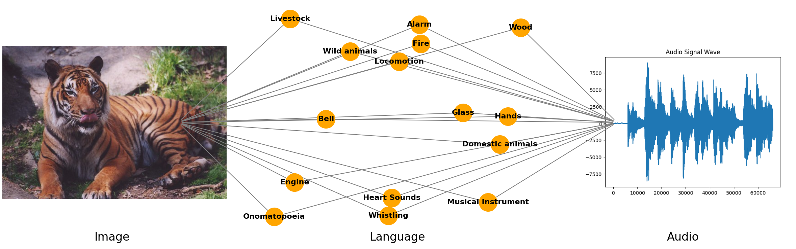

# The "Law" of the Unconscious Contrastive Learner



This repository contains the code for our paper "The 'Law' of the Unconscious Contrastive Learner: Probabilistic Alignment of Unpaired Modalities".

## Repository Structure

Our code is split into three main parts:

- `didactic-experiments/`: All code for synthetic experiments
- `real-world-experiments/`: CLIP/CLAP experiments
- `rl-experiments/`: Contrastive reinforcement learning experiments

## Didactic Experiments

### Getting Started

First, set up your environment and install the dependencies:
```bash
pip install -r requirements.txt
```

### Running Experiments

To run the experiments:
1. Run `run_trial.py` with your chosen command line arguments (see `main` for options)
2. Check out `analyze_experiments.ipynb` to analyze your results
3. Need to combine results from different runs? Use `combine.py` to merge your CSV files

## Real-World Experiments

Here you'll find notebooks for working with pre-trained contrastive models like CLIP, CLAP, and LanguageBind.

### Data Setup

Look at `create_test_set()` in each notebook to see how to format your contrastive pairs for training.

## Reinforcement Learning Experiments

### Setup

```bash
conda create -n env python=3.10
conda activate env

pip install torch hypll wandb graphviz ipython matplotlib
```

### Running the Code

1. Get everything installed:
```bash
pip install -r requirements.txt
```

2. You can run with two main options:
   - `train.py`: Runs contrastive RL on a simple maze
   - `train_streets.py`: Handles unconscious contrastive reinforcement with (state, state-action) and (state, language) pairs
