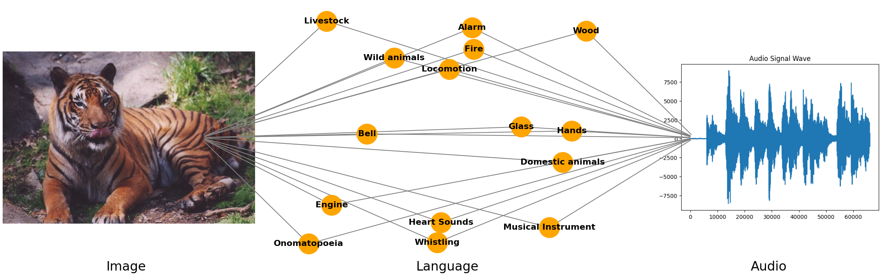

# The "Law" of the Unconscious Contrastive Learner



Code for "The 'Law' of the Unconscious Contrastive Learner: Probabilistic Alignment of Unpaired Modalities" (Che & Eysenbach, ICLR 2025, [arXiv:2501.11326](https://arxiv.org/abs/2501.11326)).

Given contrastive models for A↔B and B↔C, we score unpaired A↔C in two ways:

- **Direct**: compare φ_A and φ_C with the critic. Lemmas 2 and 3 say when this is principled.
- **Monte Carlo (LogSumExp)**: estimate Lemma 1, log (1/M) Σ_m exp(f_AB(a, b_m) + f_BC(b_m, c)), over samples b_m of the bridge modality. This needs Assumptions 1–2 but not 3.

Results produced by this code, and corrections to the paper's experimental results, are in [`RESULTS.md`](RESULTS.md); figures are in [`figures/`](figures/README.md).

## Layout

| Path | Contents |
|---|---|
| `ucl/` | Shared core: critics, the Direct and Monte Carlo estimators, recall@k |
| `didactic/` | Synthetic experiments (Sec. 6.1, 6.2, App. C.3, C.4) |
| `real_world/` | CLIP / CLAP / ImageBind / LanguageBind experiments (Sec. 6.2.1, 6.2.2, App. C.1, C.2) |
| `rl/` | Language-conditioned contrastive RL in continuous mazes (Sec. 6.3, App. D) |
| `tests/` | Unit and end-to-end tests, including numerical checks of Lemmas 2 and 3 |

```bash
pip install -e ".[test]"   # core, didactic and RL experiments
pytest tests
```

Every experiment is a module with `--help`, fixed seeds, and machine-readable output under `results/`. The models are small; when running several experiments at once on a CPU, set e.g. `OMP_NUM_THREADS=4` per process to avoid thread oversubscription.

## Synthetic experiments

```bash
python -m didactic.run --experiment main --seeds 0-19          # Fig. 2 (shared bridge) and Fig. 3 (separate models)
python -m didactic.run --experiment ci_ablation --seeds 0-4    # Fig. 8: part of the A-C signal bypasses B
python -m didactic.run --experiment embed_2d --seeds 0-4       # Fig. 7 (2-d embeddings)
python -m didactic.report --experiment main                    # table + figures in figures/ (index: figures/README.md)
python -m didactic.ceiling --seeds 0-19 --sizes 5000 100000    # Bayes-optimal and exact-ratio Monte Carlo
```

Data: B ~ N(μ, Σ), A = √(1−ρ) M_A B + √ρ N_A U + ε_A, C = √(1−ρ) M_C B + √ρ N_C U + ε_C, with U a hidden variable independent of B. ρ = 0 (all presets except `ci_ablation`) satisfies Assumption 1; `ci_ablation` sweeps ρ from 0 to 1 and also records Bayes-optimal and exact-Lemma-1 recall. For each seed and critic (`cosine`, `dot`, `neg_sq_l2` = −½‖x−y‖²), three models are trained:

- `unconscious`: φ_A↔φ_B and φ_B↔φ_C with a shared φ_B.
- `disparate`: two independent models, φ_A↔φ_B1 and φ_B2↔φ_C.
- `ground_truth`: an oracle trained on (A, C) pairs.

All methods report recall@1 over groups of 32 held-out triplets. The Monte Carlo estimate sums over an independent pool of B samples (5k per epoch, plus 100k for the final model), using the trained critic including its learned logit scale. Hyperparameters live in `BASE` and `PRESETS` in `didactic/run.py` and can be overridden from the command line.

## Pretrained-model experiments

1. **Data.** Download AudioCaps clips ([CSVs](https://github.com/cdjkim/audiocaps/tree/master/dataset); needs `yt-dlp` and `ffmpeg`), extract audio and middle frames, and build a manifest with disjoint `test` / `val` / `bridge` splits:
   ```bash
   python -m real_world.prepare_data download --captions audiocaps.csv --out raw_mp4s/ --limit 1000
   python -m real_world.prepare_data extract --videos raw_mp4s/ --out data/clips
   python -m real_world.prepare_data manifest --clips data/clips --out data/manifest.csv \
       --captions audiocaps.csv --audiocaps
   curl -L -o data/ontology.json https://raw.githubusercontent.com/audioset/ontology/master/ontology.json
   # optional: a large text-only bridge (AudioCaps captions of videos *not* in the manifest)
   python -m real_world.prepare_data caption-pool --captions audiocaps.csv --manifest data/manifest.csv
   ```
2. **Embed once.** Embeddings are cached unit-norm with each model's trained logit scales (see *Environment* below):
   ```bash
   M="--manifest data/manifest.csv --ontology data/ontology.json --caption-pool data/caption_pool.txt"
   python -m real_world.embed $M --encoder clip         --sets image caption ontology caption_pool
   python -m real_world.embed $M --encoder clap         --sets audio caption ontology caption_pool
   python -m real_world.embed $M --encoder imagebind    --sets image audio caption --device cpu
   python -m real_world.embed $M --encoder languagebind --sets image audio caption ontology caption_pool
   ```
3. **Evaluate.** Recall@{1,5,10} over 100 trials of 25 test candidates, with 95% CIs:
   ```bash
   python -m real_world.evaluate --experiment clip_clap_via_text            # Fig. 4 left (ontology bridge)
   python -m real_world.evaluate --experiment clip_clap_via_caption_pool \
       --bridge-sizes 64 256 1024 4096 16384 all                            # Fig. 4 left, large caption bridge
   python -m real_world.evaluate --experiment languagebind_via_text         # Fig. 4 right
   python -m real_world.evaluate --experiment languagebind_via_caption_pool \
       --bridge-sizes 64 256 1024 4096 16384 all                            # Fig. 5
   python -m real_world.evaluate --experiment imagebind_via_image \
       --bridge-sizes 16 64 256 all                                         # Fig. 5
   python -m real_world.evaluate --experiment imagebind_clap_via_audio      # App. C.2 (1)
   python -m real_world.evaluate --experiment imagebind_clip_via_image      # App. C.2 (2)
   ```
   `python -m real_world.report` then draws `figures/real_world/` from the saved results. The critic temperature is each pair's own trained logit scale.

### Environment

ImageBind pins old torch/numpy and LanguageBind pins `transformers==4.30.2`, so use a dedicated env. This combination is tested on Apple Silicon (M2, macOS):

```bash
conda create -n ucl-rw python=3.10 && conda activate ucl-rw
pip install torch==2.1.2 torchvision==0.16.2 torchaudio==2.1.2 "numpy<2" "setuptools<70"
pip install open_clip_torch laion-clap "transformers==4.30.2" timm ftfy regex einops fvcore iopath \
    opencv-python "moviepy<2" eva-decord "peft==0.4.0" "accelerate==0.20.3" yt-dlp tqdm scipy matplotlib pytest
pip install "git+https://github.com/facebookresearch/pytorchvideo.git@28fe037d212663c6a24f373b94cc5d478c8c1a1d"
pip install --no-deps "git+https://github.com/facebookresearch/ImageBind"
git clone https://github.com/PKU-YuanGroup/LanguageBind && git -C LanguageBind checkout 7070c53
echo "$PWD/LanguageBind" > "$(python -c 'import site; print(site.getsitepackages()[0])')/languagebind.pth"
pip install --no-deps -e .
```

On Apple MPS, `embed.py` enables the CPU fallback for missing ops automatically; ImageBind's vision stem uses `Conv3d`, which MPS lacks entirely, so run ImageBind with `--device cpu`.

## Reinforcement learning experiments

A point agent moves in continuous mazes whose rows and columns carry labels ("row 3", "column 11"). The agent learns φ_A(s, a) ↔ φ_B(s_f) by contrastive RL on expert trajectories, and φ_B(s) ↔ φ_C(label) from labeled states, sharing φ_B; (s, a) and labels are never paired. To reach a label it scores 8 directions either directly, f(φ_A(s, a), φ_C(label)), or with the LogSumExp estimator over sampled future states.

```bash
for maze in fork island blank; do for seed in 0 1 2; do
    python -m rl.train --maze $maze --seed $seed       # ~15 min each on a laptop CPU
done; python -m rl.evaluate --maze $maze --seeds 0 1 2; done   # success rate and SPL
python -m rl.report                                             # Fig. 13 in figures/rl/
```

## Citation

```bibtex
@inproceedings{che2025law,
  title     = {The ``Law'' of the Unconscious Contrastive Learner: Probabilistic Alignment of Unpaired Modalities},
  author    = {Che, Yongwei and Eysenbach, Benjamin},
  booktitle = {International Conference on Learning Representations},
  year      = {2025}
}
```
